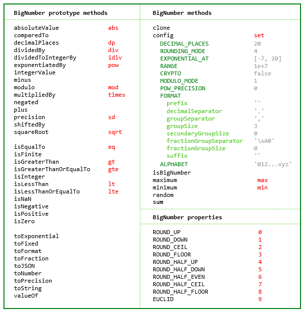
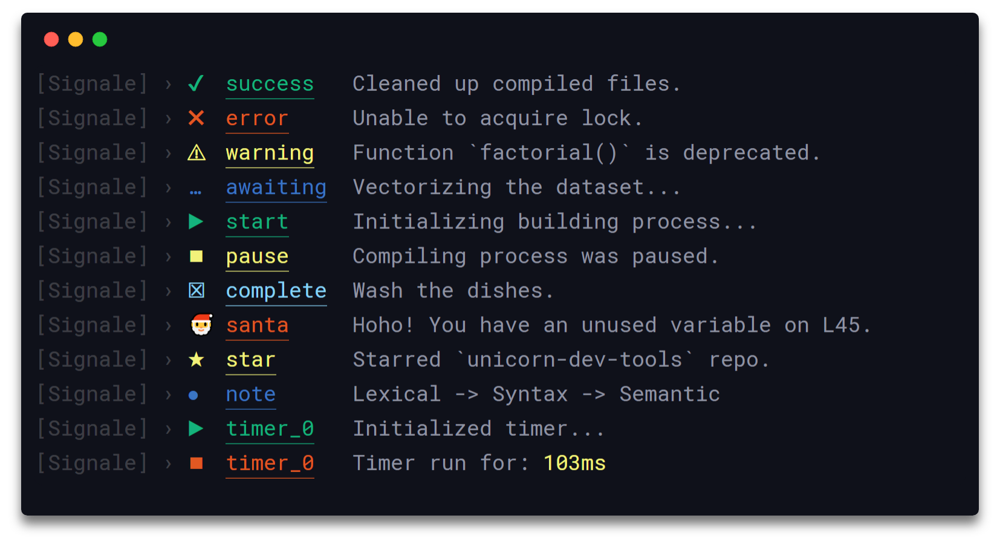

# npm包说明

## bignumber.js
> 数组转换、格式化显示，包括整数、小数

> 官网: https://mikemcl.github.io/bignumber.js/

## color
> 如字面意思，可以处理颜色：变亮、变暗，rgb或者hex格式化

> https://github.com/Qix-/color

## countup.js
> 给数字变化添加动画

> 官网：https://inorganik.github.io/countUp.js/

## dayjs
> 日期格式化，类似`moment`

> 官网：https://day.js.org/zh-CN/

## libxmljs
> 提供xml文件转换，从xml获取节点信息

> https://github.com/libxmljs/libxmljs

## lowdb
> 快捷操作json文件读写等

> https://github.com/typicode/lowdb

## moment
> 日期转换、运算、格式化等，类似`dayjs`

> 官网：https://momentjs.com/

## numeral
> 数值格式化，转换字符串、日期、时间、金额、存储单位等

> 官网：http://numeraljs.com/

## nzh
> 转换阿拉伯数字与中文数字

> 官网：https://blog.whyoop.com/nzh/docs/#/

## signale
> 可扩展的日志记录器

## uuidjs
> 生成UUID

> github.com/LiosK/UUID.js